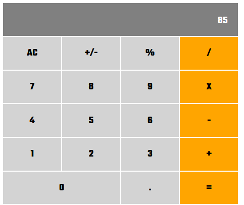

<!-- PROJECT LOGO -->
 

  

  <h3 align="center">React Calculator</h3>

  

    A calculator app built with React
     
    <a href="https://github.com/Usagib/react-calculator"><strong>Explore the docs »</strong></a>
     
     
    <a href="https://usagi-react-calculator.herokuapp.com/">View Demo</a>
    ·
    <a href="https://github.com/Usagib/react-calculator/issues">Report Bug</a>
    ·
    <a href="https://github.com/Usagib/react-calculator/issues">Request Feature</a>
  

<!-- TABLE OF CONTENTS -->
## Table of Contents

- [Table of Contents](#table-of-contents)
- [About The Project](#about-the-project)
- [Highlights](#highlights)
- [Built With](#built-with)
- [Contributing](#contributing)
- [License](#license)
- [Contact](#contact)
- [Acknowledgements](#acknowledgements)

## About The Project

Calculator built on React using ES6

## Highlights

* Easy to use UI
* Most used common operations

## Built With

* React

## Contributing

1. Fork the Project
2. Create your Feature Branch (`git checkout -b feature/AmazingFeature`)
3. Commit your Changes (`git commit -m 'Add some AmazingFeature'`)
4. Push to the Branch (`git push origin feature/AmazingFeature`)
5. Open a Pull Request

## License

Distributed under the MIT License.

<!-- CONTACT -->
## Contact

Eduardo Bonilla Cáceres - eduardobonillac@gmail.com
[Twitter](https://www.twitter.com/usagibonilla)

<!-- ACKNOWLEDGEMENTS -->
## Acknowledgements
* [Microverse](https://www.microverse.org/)
